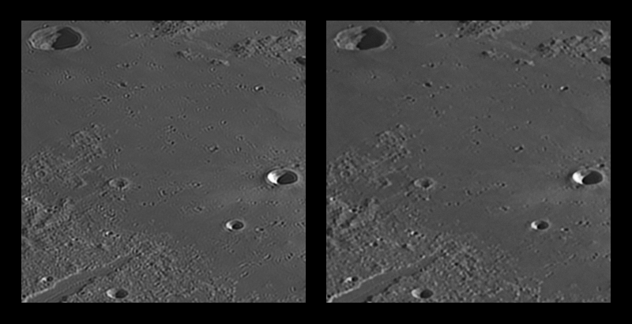

# GibbsRemovalFilter

This library is an implementation of a very simple image filter that can help minimize oscillations and ringing artifacts near sharp edges. These artifacts are mainly due to diffraction and the Gibbs phenomenon.

Example:

## How to use it

1. Create a new **GibbsRemovalFilter** for your image
2. Make and get processed image through call of **ProcessImage** method. You can call this method for the created filter multiple times with different parameters. The only custom filter parameter is the variation estimation window.

**Almost certainly you will need to apply some Gaussian blur for the resulting image, because the filter generates prominent areas of constant values. You can then accurately apply sharpening or contrast enchanecement to reduce this blur.**

It is recommended to use oversampled images with suppressed high-frequency noise.

## Build requirements

Target platform: .NET Standard 2.1 (2.1 not really needed, you can tweak a couple of lines to make this code work in previous versions)

## Author

[Aleksandr Obukhov](https://github.com/aleksandrrr-ob)

## License

This project is licensed under the MIT License - see the [LICENSE](LICENSE) file for details
